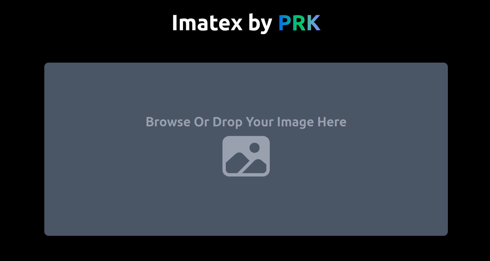

# 🧠 Image-to-Text Converter (Tesseract.js)



🔗 **Live Demo:** [imatex.vercel.app](https://imatex.vercel.app)

A lightweight web app that extracts and converts text from images using **Tesseract.js**, a pure JavaScript OCR engine.  
Upload or drag & drop an image, and it instantly converts the image into editable text — all processed locally in your browser.

---

## ✨ Features

- 📷 **Upload or Drag & Drop** — easily add images for OCR processing
- ⚡ **Client-Side OCR** — uses `Tesseract.js`, no backend or external API
- 🧾 **Instant Text Extraction** — converts images to editable text in seconds
- 🔒 **Privacy Friendly** — everything runs locally in the browser
- 🎨 **Modern UI** — built with Next.js, React, and Tailwind CSS

---

## 🧩 Tech Stack

| Component  | Technology               |
| ---------- | ------------------------ |
| Framework  | **Next.js (TypeScript)** |
| OCR Engine | **Tesseract.js**         |
| Styling    | **Tailwind CSS**         |
| Icons      | **React Icons**          |

---

## 🚀 Getting Started

### 1️⃣ Clone the Repository

```bash
git clone https://github.com/your-username/image-to-text-converter.git
cd image-to-text-converter
```

### 2️⃣ Install Dependencies

```bash
npm install
```

### 3️⃣ Run the Development Server

```bash
npm run dev
```

Then open your browser at [http://localhost:3000](http://localhost:3000)

---

## 🧠 How It Works

1. Upload or drag & drop an image file
2. The app passes the image to Tesseract.js
3. Tesseract performs Optical Character Recognition (OCR)
4. Extracted text appears instantly in the interface

---

## 🖼️ Example Use Cases

- Extract text from scanned documents or receipts
- Convert handwritten notes or printed text to editable content
- Use in hackathons or as a quick OCR utility tool
- Learn how to integrate Tesseract.js with Next.js

---

## 📁 Folder Structure

```
imatex/
├── app/
│   ├── page.tsx              # ✅ Main upload + OCR page
│   ├── layout.tsx            # ✅ Root layout
│   ├── components/
│   │   ├── UploadFileSection.tsx
│   │   ├── cards/
│   │   │   └── TextCard.tsx
│   │   └── layout/
│   │       └── Header.tsx
├── lib/
│   └── convertor.ts          # ✅ Tesseract.js OCR logic
├── styles/
│   └── globals.css
├── public/
├── package.json
└── README.md
```

---

## 📜 License

This project is open-source and available under the [**MIT License**](LICENCE).

---

## 👨‍💻 Author

**Md. Parvez Khan**  
📧 [meprkbd@gmail.com](mailto:meprkbd@gmail.com)  
💼 [prkbd.me](https://prkbd.me)  
🧠 Built with ❤️ using **Next.js** and **Tesseract.js**
